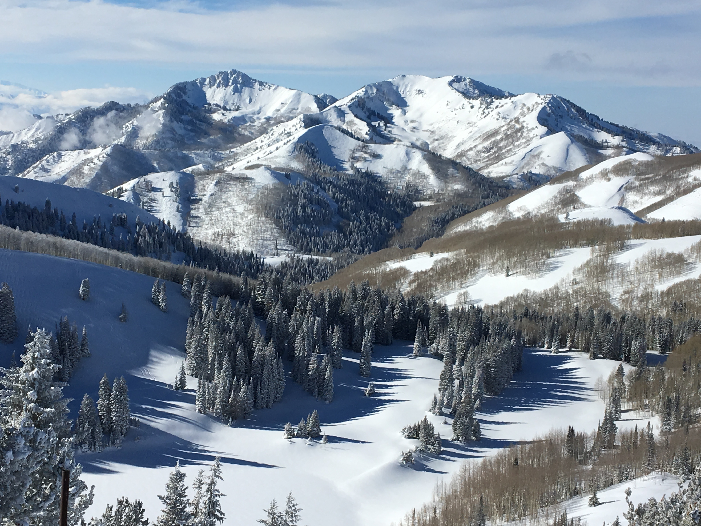
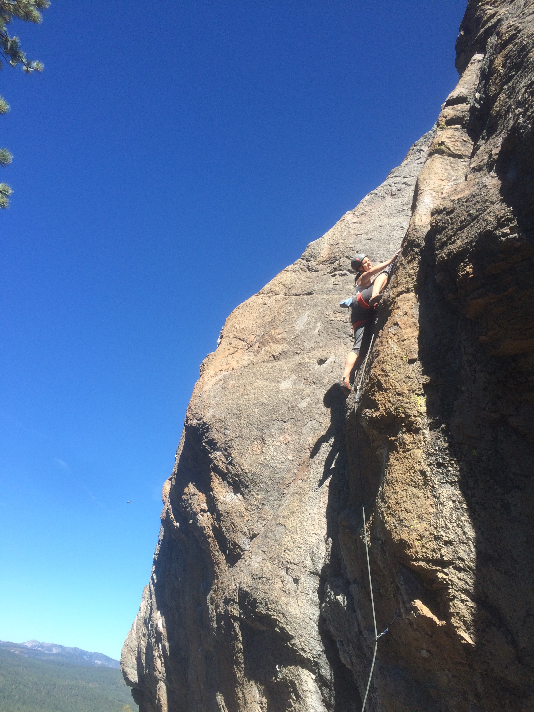

<link rel="stylesheet" href="_layouts/styles.css" type="text/css">

```{r setup, include=FALSE}
knitr::opts_chunk$set(echo = FALSE)
library(ggplot2)
library(shiny)
```


Outside of playing with new R packages, I like rock climbing, hiking, skiing, and stuff outside. This tab is mostly just an excuse to show off some of those pictures. Here are some pictures from skiing in Utah.. 

<br><br>

..and rock climbing near Lake Tahoe.

<br>

```{r, eval = FALSE}
# random walk function
randomWalk = function(numSteps = 100, prob = 0.5, init = 0){
  walk = rep(NA, numSteps)
  walk[1] = init
  for(i in 1:(numSteps-1) ){
    Z = rbinom(1,1, prob)
    walk[i+1] = walk[i] + ifelse(Z == 1, 1, -1)
  }
  return(walk)
}


```


```{r walk, eval = FALSE}

#Speaking of hiking, let's take a random walk.
inputPanel(
  selectInput("prob", label = "Probability of taking a step left:",
              choices = c(0, 0.25, 0.5, 0.75, 1), selected = 0.5),
  
  sliderInput("n_steps", label = "Number of steps:",
              min = 10, max = 1000, value = 100, step = 1)
)

renderPlot({
  walk = randomWalk(numSteps = as.numeric(input$n_steps), prob = as.numeric(input$prob))
  walk.df = data.frame(path = walk, step = 1:length(walk))

  ggplot(walk.df, aes(step, walk)) + theme_bw() + geom_line(lwd = 2) +
  labs(x = "Step", y = "Path")
 
  
})
```
