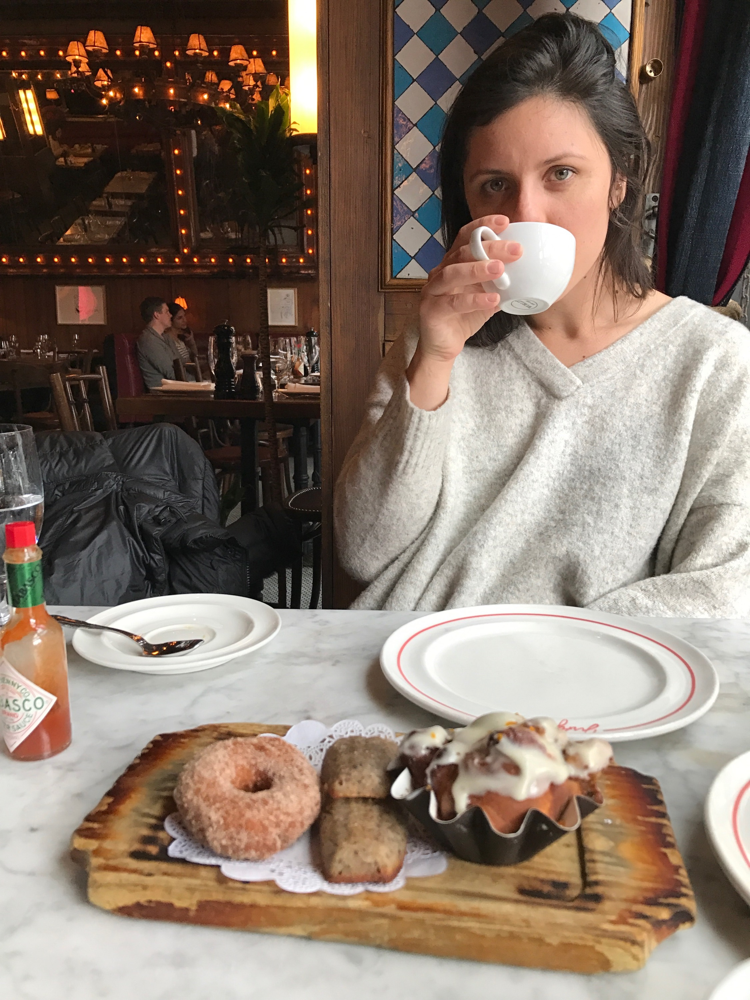

<link rel="stylesheet" href="academicons.css"/>
<link rel="stylesheet" href="styles.css" type="text/css">

### Assistant Professor of Biostatistics
### University of Colorado Denver

  

I obtained a BA in chemistry from [Swarthmore College](http://www.swarthmore.edu/) in 2010 and a PhD in biostatistics from [Columbia University](https://www.mailman.columbia.edu/become-student/departments/biostatistics) in 2019. My dissertation was advised by [Jeff Goldsmith](http://jeffgoldsmith.com/) and focused on methods for analyzing and visualizing functional data, with applications in wearable devices, structural MRI, and neurobiology. I joined the Colorado School of Public Health as an assistant professor in 2019.

 

#### Contact Information

Julia Wrobel
[Department of Biostatistics & Informatics](http://www.ucdenver.edu/academics/colleges/PublicHealth/Academics/departments/Biostatistics/Pages/welcome.aspx)  
[Colorado School of Public Health](http://www.ucdenver.edu/academics/colleges/PublicHealth/Pages/default.aspx)  
Building 500, Room W4137
 
13001 East 17th Place
 
Aurora, Colorado 80045

Email: [julia.wrobel@cuanschutz.edu](mailto:julia.wrobel@cuanschutz.edu)  
