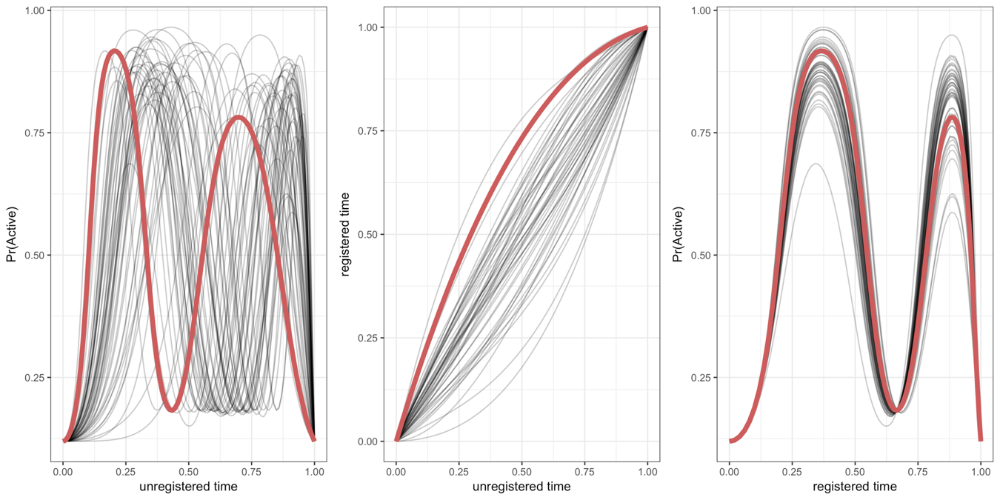
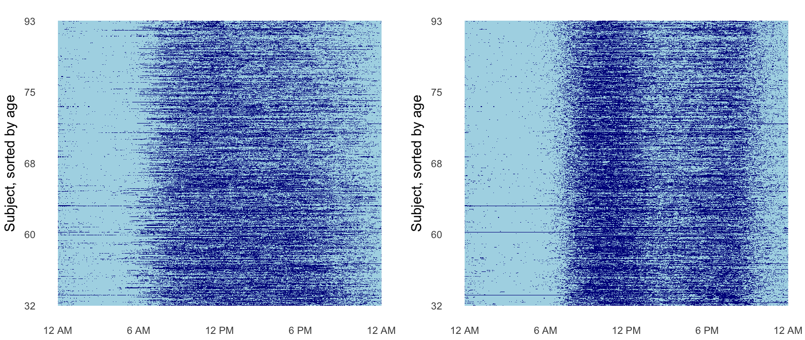
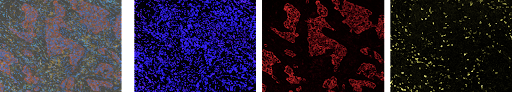

<link rel="stylesheet" href="academicons.css"/>
<link rel="stylesheet" href="styles.css" type="text/css">

## Functional Data Analysis

My functional data work is broadly focused on methods for functional registration, regression, and dimension reduction. A subset of this work is summarized below.

### Curve Registration for Functional Data

I developed a method to **register exponential family functional data**, which was published in [Biometrics](https://onlinelibrary.wiley.com/doi/abs/10.1111/biom.12963) in 2019. Our methods are implemented in the `registr` package, an `R` package on CRAN and GitHub you can download [here](https://github.com/julia-wrobel/registr).

If each curve represents an observation for one subject, then _curve registration_ refers to warping the domain (often time) of a set of curves so that the main features of each curve are aligned across subjects. An example with simulated data is below.

  

_Warping functions_ (center) are applied to the _unregistered curves_ (left) to get _registered_ curves (right). The _exponential family_ part comes in because not all functional observations are Gaussian or continuous. Our approach to registration allows alignment of data that is discrete as well as continuous. 

Below our method is applied to accelerometer data where each subject's binary activity (active vs. not active) is collected at every minute over 24 hours. Periods of inactivity are colored in light blue and periods of activity are colored in dark blue. Applying our registration technique to the activity data pulls out patterns in physical activity.

  

1. **J Wrobel** (2018). [registr: Registration for exponential family functional data](https://joss.theoj.org/papers/9c40c4f0ede1827cc5a9430c625d6494). *The Journal of Open Source Software*.
2. **J Wrobel**, V Zipunnikov, J Schrack, and J Goldsmith (2019).
[Registration for exponential family functional data](https://onlinelibrary.wiley.com/doi/full/10.1111/biom.12963). *Biometrics*.
3. **J Wrobel** and A Bauer (2021). [registr 2.0: Incomplete Curve Registration for Exponential Family Functional Data](https://joss.theoj.org/papers/10.21105/joss.02964.pdf).
 *The Journal of Open Source Software*.
4. E McDonnell, V Zipunnikov, J Schrack, J Goldsmith, and  **J Wrobel** (2022).
[Registration of 24-hour accelerometric rest-activity profiles and its application to human chronotypes](https://www.tandfonline.com/doi/abs/10.1080/09291016.2021.1929673). *Biological Rhythm Research*.

## Single Cell Multiplex Imaging

Since 2019 I have been developing tools and methodology for analysis of **multiplex single cell imaging** (MI) data, an emerging image analysis technique that has revolutionized researchers’ ability to study tissue structure and function at a cellular level while preserving the original spatial context. *Single cell* refers to individual cell resolution, *multiplex* refers to multiple types of proteins in the tissue that are tagged, allowing for identification of nuanced cell subtypes, function, and tissue regions, and *imaging* indicates that biological spatial relationships in the tissue are preserved. An example image from a [paper](https://www.sciencedirect.com/science/article/abs/pii/S1556086421021754) I worked on studying tumor-immune relationships in non-small cell lung carcinoma is below.

  

This image is a multichannel TIFF files, where each channel represents signal intensity of a particular protein. The left panel is the composite image combining all 8 channels collected for this dataset.The next three images are three individual channels from the same image, shown, from left to right, the nucleus (DAPI) channel, the tumor (cytokeratin) channel, and the immune (CD8) channel.

Multiplex imaging data has a complex data acquisition, image processing, and analysis pipeline with unique challenges that can be addressed by statisticians. First, tissue is placed on a slide and labeled with multiple (multiplex) antibody markers. These images are then segmented to identify tissue compartments (e.g. tumor vs. stroma), cells, and nuclei. Marker intensities across samples must be normalized and batch corrected to account for non-biological variability. Then cells are *phenotyped*, or given biological label(s) based on their mean marker intensities. Finally, the datasets are undergo compositional and spatial analysis, potentially in combination with patient level outcomes such as survival time, disease subtype, or cancer stage. To address these challenges, I have developed methods and software for normalizing multiplex imaging data (1,2), for analyzing continuous marker expression using density-based variation analysis (3), for spatial analysis using scalar spatial summaries (4), and for spatial analysis using techniques drawn from functional data analysis (5, 6).

1. CR Harris, **J Wrobel**, SN Vandekar. [mxnorm: An R Package to Normalize Multiplexed Imaging Data (2022)](https://joss.theoj.org/papers/10.21105/joss.04180.pdf). *The Journal of Open Source Software*.
2. CR Harris, ET McKinley, JT Roland, Q Liu, MJ Shrubsole, KS Lau, RJ Coffey, **J Wrobel**, and SN Vandekar (2022).
[Quantifying and correcting slide-to-slide variation in multiplexed immunofluorescence images.](https://pubmed.ncbi.nlm.nih.gov/34983062/) <i> Bioinformatics</i>.
3. S Seal, T Vu, T Ghosh, **J Wrobel**, and D Ghosh (2022). [DenVar: Density-based Variation analysis of multiplex imaging data](https://academic.oup.com/bioinformaticsadvances/article/2/1/vbac039/6590640).  *Bioinformatics Advances*.
4. B Steinhart, KR Jordan, J Bapat, MD Post,  LW Brubaker, BG Bitler, and  **J Wrobel** (2021).
[The Spatial Context of Tumor-Infiltrating Immune Cells Associates with Improved Ovarian Cancer Survival](https://pubmed.ncbi.nlm.nih.gov/34615692/). *Molecular Cancer Research*. 
5. T Vu, **J Wrobel**, BG Bitler, EL Schenk, KR Jordan, and D Ghosh (2022). [SPF: a spatial and functional data analytic approach to cell imaging data](https://pubmed.ncbi.nlm.nih.gov/35704658/). *PLoS Computational Biology*.
6. T Vu, S Seal, **J Wrobel**, T Ghosh, M Ahmadian, D Ghosh (2022). [FunSpace: A functional and spatial analytic approach to cell imaging data using entropy measures](https://www.biorxiv.org/content/10.1101/2022.06.17.496475v1.full.pdf). *bioRxiv*.

