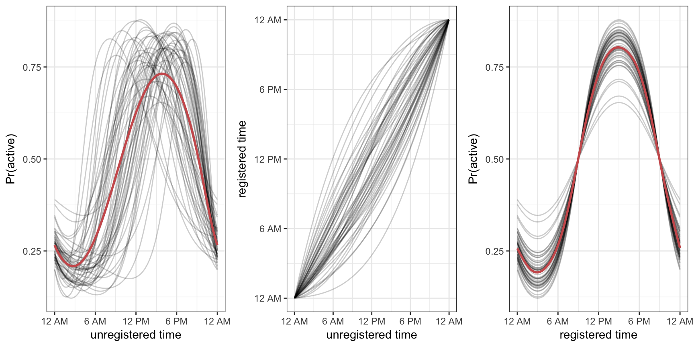

<link rel="stylesheet" href="/Users/juliawrobel/julia-wrobel/css/academicons.css"/>
<link rel="stylesheet" href="/Users/juliawrobel/julia-wrobel/css/styles.css" type="text/css">

### Curve Registration

Right now I'm developing a method to **register exponential family functional data**. If each curve represents an observation for one subject, then _curve registration_ refers to warping the domain (often time) of a set of curves so that the main features of each curve are aligned across subjects. An example with simulated data is below.

  

We apply _warping functions_ (center) to the _unregistered curves_ (left) to get our _registered_ curves (right).

The _exponential family_ part comes in because not all functional observations are Gaussian or continuous. Our approach to registration allows alignment of data that is binary as well as continuous. 

We apply our method to accelerometer data where each subject's binary activity (active vs. not active) is collected at every minute over 24 hours. Applying our registration technique to the activity data pulls out patterns in physically activity.

  